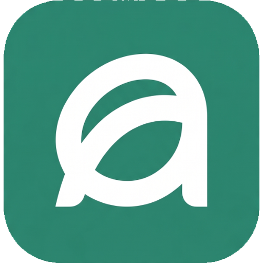
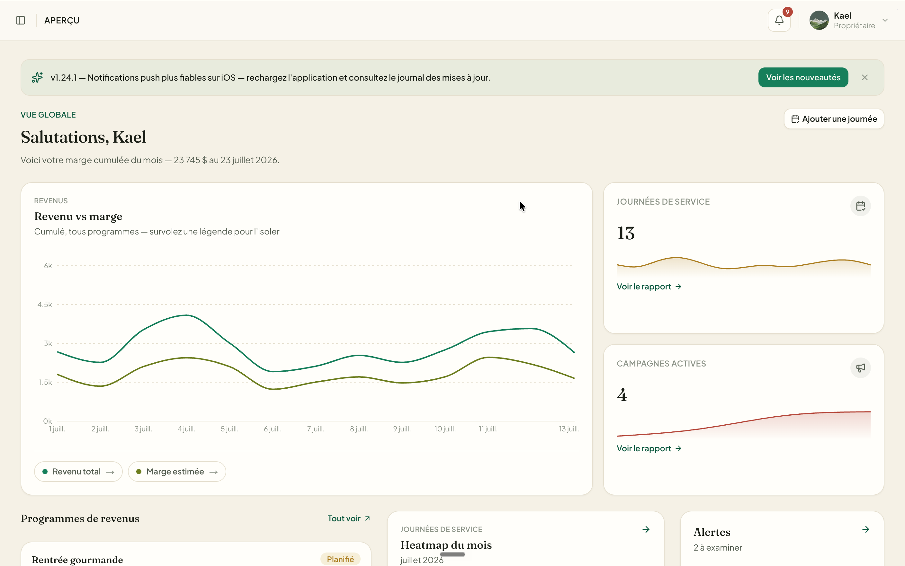

<div align="center">



# 🌿 Flow par Minerva

### *La plateforme SaaS de gestion opérationnelle unifiée pour restaurants et cafés*

[](https://minerva-flow.vercel.app)
[](https://nextjs.org/)
[](https://supabase.com)
[](https://www.typescriptlang.org/)
[](#-licence)

<br />

[✨ Découvrir l'Application Live](https://minerva-flow.vercel.app) • [📖 Guide des Intégrations](docs/integrations.md) • [🔒 Confidentialité](app/[locale]/legal/privacy/page.tsx) • [📄 Conditions](app/[locale]/legal/terms/page.tsx)

<br /><br />



</div>

---

## ⚡ En Bref

**Flow par Minerva** est une application web SaaS de nouvelle génération conçue spécifiquement pour piloter l'exploitation quotidienne des restaurants, cafés, bistros et bars. 

Elle centralise en une seule interface fluide, moderne et en français tout le cycle opérationnel d'un établissement : **revenus, dépenses, ingénierie de menu, planification des horaires, gestion des fournisseurs, inventaire, fidélisation client et intelligence artificielle décisionnelle.**

---

## 🛠️ Stack Technique & Écosystème

| Catégorie | Technologie |
|---|---|
| **Framework & SSR** | **Next.js 16** (App Router, Turbopack, React 19) |
| **Langage** | **TypeScript** typé à 100% |
| **Base de Données & Sécurité** | **Supabase** (PostgreSQL, Row Level Security, Vault) |
| **Authentification** | **Supabase Auth** (Mots de passe, OTP 6 chiffres, OAuth Google/Apple/Microsoft) |
| **Design System & UI** | **Vanilla CSS & Design System Minerva** (`--mv-*`), `@thesvg/react` icons, Framer Motion |
| **Intelligence Artificielle** | **Vercel AI SDK & Claude / Gemini** (Analyses financières, suggestions IA, revues de menu) |
| **Point de Vente (POS)** | **Square POS API** |
| **Paiements & Webhooks** | **Stripe Connect & Stripe Checkout** |
| **Courriels Transactionnels** | **Resend API** |
| **Déploiement Cloud** | **Vercel Infrastructure** |

---

## 🔥 Fonctionnalités Principales

### 🤖 1. Assistant IA & Interface Sana Style (`/chat`)
- Chat IA avec pilules d'action rapide (`+ Sources`, `⚡ Créer`, `Bibliothèque`).
- Cartes de suggestions contextuelles (*Revenus*, *Marges*, *Équipe*, *Inventaire*).
- Widget de quota de requêtes IA en direct avec raccourcis vers les workflows opérationnels.

### 📚 2. Bibliothèque d'Assets Unifiée (`/library`)
- Espace centralisé réunissant tous les documents de l'établissement : bons de commande fournisseurs, fiches recettes de menu, plannings de service, factures.
- Filtres par catégorie et tiroir de prévisualisation rapide en écran scindé.

### 🔌 3. Hub des Intégrations Directes (`/integrations`)
- Statuts de connexion en temps réel pour **Square POS**, **Stripe Connect**, **Google Workspace / Analytics**, **Services de Livraison (Uber Eats)** et **Resend**.
- Tiroir latéral de configuration et gestion des jetons sécurisés.

### 🔑 4. Authentification 2 Colonnes & Code OTP 6 Chiffres (`/login`)
- Layout moderne avec carte de connexion sur la gauche et aperçu dynamique interactif Minerva sur la droite.
- Envoi et vérification instantanés de codes OTP à 6 chiffres via SMS / Courriel et réinitialisation de mot de passe fonctionnelle.

### 📅 5. Horaire & Synchro Google Calendar Bidirectionnelle 2 Sens (`/horaire`)
- Planification intelligente des quarts de travail des employés.
- **Synchronisation 2 Sens** : Lecture automatique des congés et indisponibilités déjà présents dans le calendrier Google des employés pour éviter les conflits d'horaires.
- Auto-refresh transparent des jetons OAuth Google expirés.

### 🏢 6. Google Business Profile & Avis Clients
- Synchronisation des heures d'ouverture et consultation/réponse directe aux avis clients Google dans l'interface.
- Intégration préparée pour *Reserve with Google* (réservation directe depuis Google Maps/Recherche).

### 🛒 7. Commandes en Ligne & Ingrédients
- Menu en ligne accessible par lien public (`/m/[token]`) avec calcul automatique des taxes et pourboires.
- Gestion des fournisseurs, génération de bons de commande et répercussion directe dans l'inventaire.

### 🎁 8. Portail Client & Programme de Fidélité (`/portal`)
- Accès client sans mot de passe (Lien Magique) pour consulter les points de fidélité, le catalogue de récompenses et le lien de parrainage.

---

## 📂 Architecture de la Codebase

```
Minerva-Flow/
├── app/                        # Next.js 16 App Router avec i18n
│   ├── [locale]/
│   │   ├── (app)/              # Application protégée par authentification
│   │   │   ├── chat/           # Assistant IA (Style Sana)
│   │   │   ├── horaire/        # Planning d'équipe & Synchro Calendar
│   │   │   ├── integrations/   # Hub d'intégrations API
│   │   │   ├── library/        # Bibliothèque d'assets & documents
│   │   │   ├── reports/        # Rapports financiers & analytiques
│   │   │   └── changelog/      # Journal des mises à jour in-app
│   │   ├── legal/              # Pages légales (Privacy & Terms)
│   │   ├── portal/             # Portail client sans mot de passe
│   │   ├── login/              # Écran d'authentification 2 colonnes
│   │   └── page.tsx            # Landing Page publique
├── components/                 # Composants React typés
│   ├── auth/                   # AuthCard, OtpInput
│   ├── chat/                   # Sana AI Assistant components
│   ├── integrations/           # IntegrationsView & cartes API
│   ├── library/                # LibraryView & Asset drawers
│   ├── minerva/                # Composants du Design System Minerva
│   └── ui/                     # BrandIcons (@thesvg/react), Buttons, Badges
├── lib/                        # Logique métier & services backend
│   ├── data/                   # requêtes Supabase (Library, Integrations, Changelog)
│   ├── google/                 # API Google (Config, Calendar 2-way, Business, Tokens)
│   ├── square/                 # Intégration POS Square
│   ├── stripe/                 # Connect & Checkout Stripe
│   └── supabase/               # Clients Supabase (Server, Admin, Browser)
├── supabase/                   # Migrations SQL & Schéma de base de données
└── docs/                       # Guides des intégrations et protocoles
```

---

## 🚀 Installation & Lancement Local

### Prérequis
- **Node.js** v18 ou v20+
- **npm** ou **pnpm**
- Un projet **Supabase** configuré

### 1. Cloner le projet & installer les dépendances
```bash
git clone https://github.com/Endsi3g/Minerva-Flow.git
cd Minerva-Flow
npm install
```

### 2. Configurer les variables d'environnement
Créez un fichier `.env.local` à la racine :
```env
NEXT_PUBLIC_SUPABASE_URL=https://votre-projet.supabase.co
NEXT_PUBLIC_SUPABASE_ANON_KEY=votre-cle-anon
SUPABASE_SERVICE_ROLE_KEY=votre-cle-service-role
NEXT_PUBLIC_APP_URL=http://localhost:3000
GOOGLE_CLIENT_ID=votre-google-client-id
GOOGLE_CLIENT_SECRET=votre-google-client-secret
```

### 3. Démarrer le serveur de développement
```bash
npm run dev
```
Accédez à l'application sur [http://localhost:3000](http://localhost:3000).

---

## 🌍 Déploiement en Production

Le projet est configuré pour un déploiement continu instantané sur **Vercel** :

```bash
git add .
git commit -m "feat: SaaS README redesign and feature update"
git push origin main
```

L'application est déployée en direct sur : **[https://minerva-flow.vercel.app](https://minerva-flow.vercel.app)**

---

## ⚖️ Conformité & Sécurité

- **Loi 25 du Québec** : Gestion stricte de la confidentialité des données personnelles et droit à l'oubli.
- **Google OAuth Limited Use Disclosure** : Conformité avec les exigences de vérification Google Cloud Console pour les accès non sensibles (`openid`, `email`, `profile`).

---

<div align="center">

*Propulsé par l'équipe Minerva — Fait avec passion au Québec 🇨🇦*

</div>