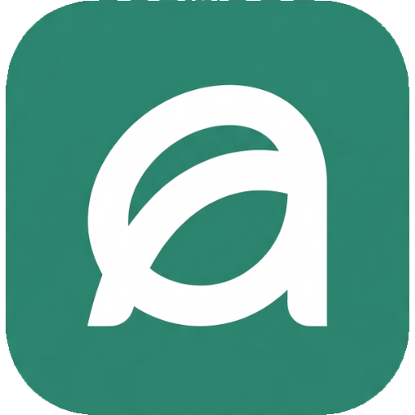
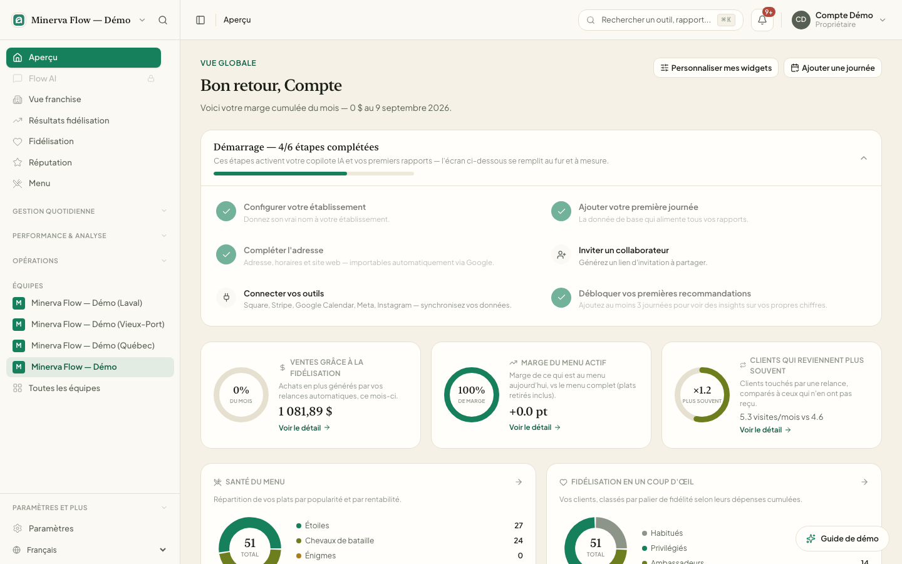
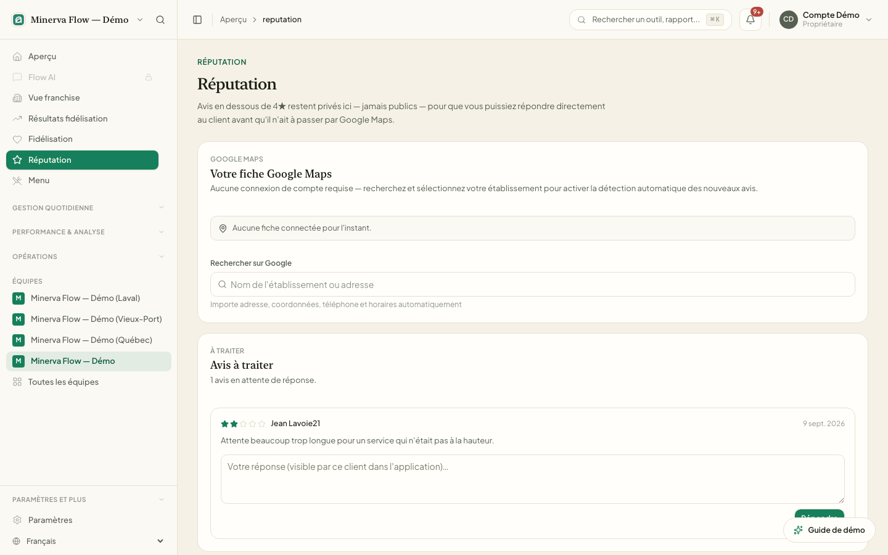
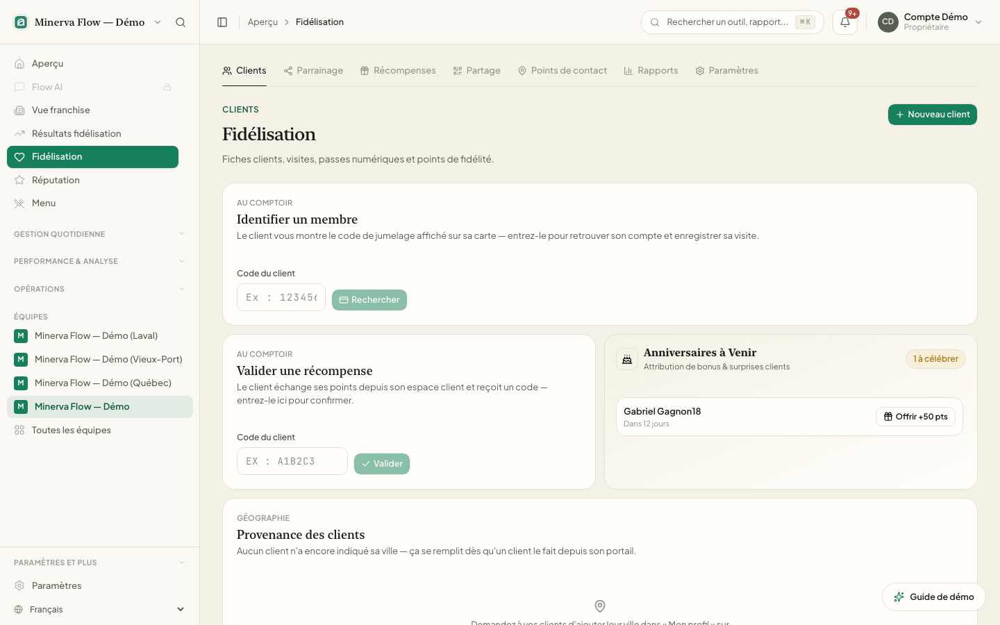
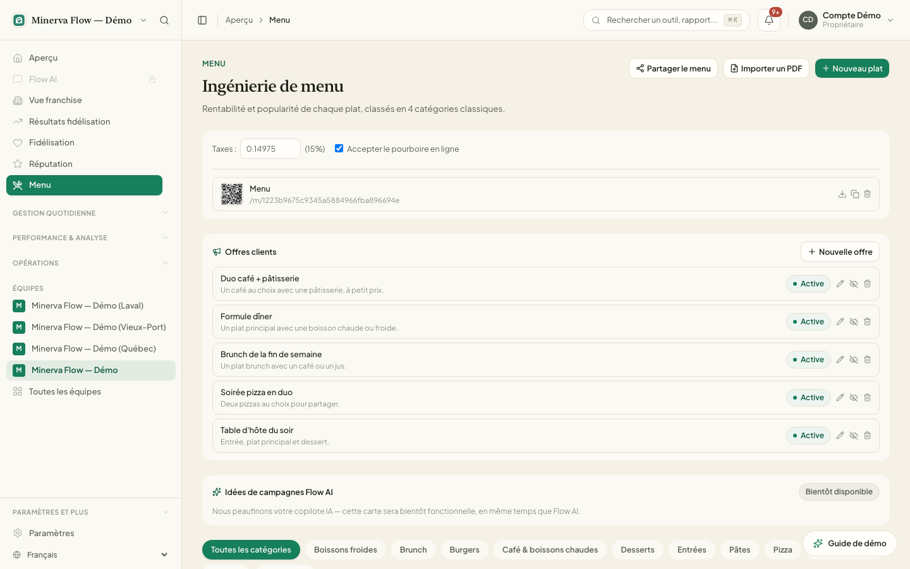
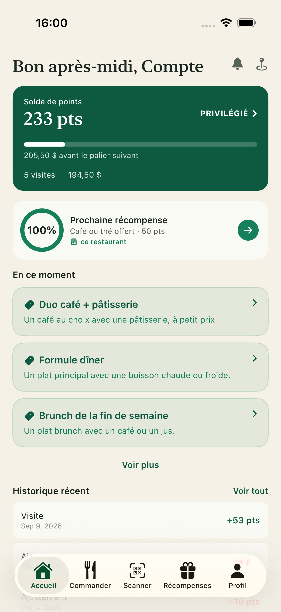
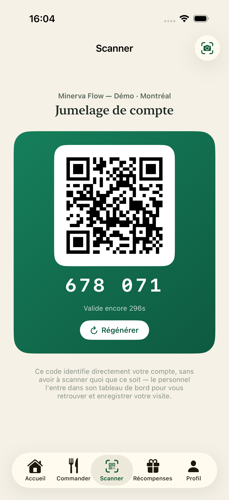
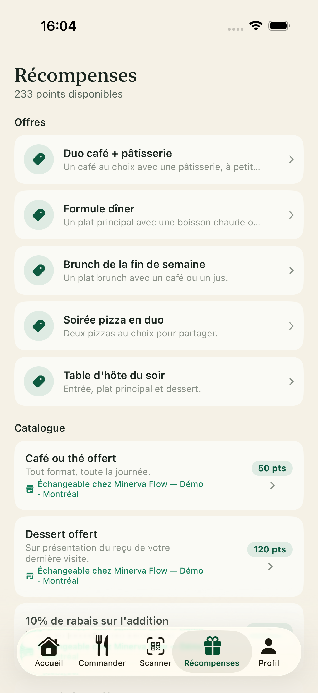
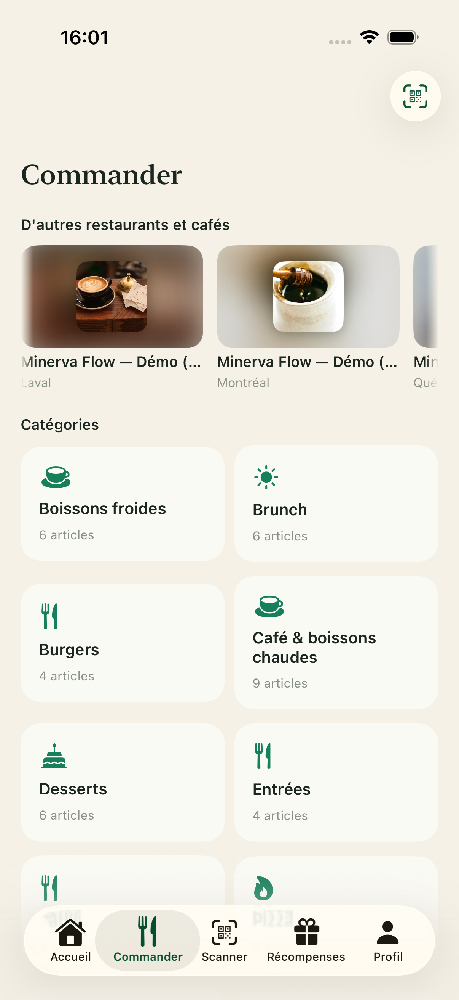

# Minerva Flow

### Système d'Exploitation & d'Analyse Intelligente pour Restaurants et Cafés

 

[Accéder à l'application](https://minerva-flow.vercel.app) • [Sitemap XML](https://minerva-flow.vercel.app/sitemap.xml) • [Guide des intégrations](docs/integrations.md) • [Politique de confidentialité](app/[locale]/legal/privacy/page.tsx) • [Conditions d'utilisation](app/[locale]/legal/terms/page.tsx)

  

---

## Aperçu Général

**Minerva Flow** est la plateforme logicielle complète conçue pour simplifier et unifier le pilotage quotidien des établissements de restauration indépendants, cafés, bistros et brasseries au Québec et en France.

Dans un secteur où les marges sont souvent serrées et les opérations fragmentées entre de multiples outils incomplets, Minerva Flow offre une interface centralisée, intuitive et moderne. Elle permet aux propriétaires et gérants d'éliminer la gestion manuelle sur papier ou tableur, d'optimiser leurs coûts de revient et d'assurer une rentabilité durable.

Deux applications, une seule plateforme : un **tableau de bord web** pour le propriétaire et son équipe, et une **application native iOS** que leurs clients installent pour cumuler des points, commander et suivre leurs récompenses.

---

## Aperçu Visuel

### Tableau de bord (propriétaire)

<table>
<tr>
<td width="50%"> <b>Vue globale</b> — marge, ventes de fidélité, santé du menu, en un coup d'œil</td>
<td width="50%"> <b>Réputation</b> — avis privés (&lt;4★) à traiter avant qu'ils n'atteignent Google Maps</td>
</tr>
<tr>
<td width="50%"> <b>Fidélisation</b> — identification au comptoir par code de jumelage, récompenses, anniversaires</td>
<td width="50%"> <b>Ingénierie de menu</b> — offres, QR code du menu, catégories</td>
</tr>
</table>

### Application native iOS (client)

<table>
<tr>
<td width="25%"> <b>Accueil</b></td>
<td width="25%"> <b>Jumelage</b></td>
<td width="25%"> <b>Récompenses</b></td>
<td width="25%"> <b>Commander</b></td>
</tr>
</table>

---

## Ce qu'apporte l'application aux restaurateurs

### 1. Pilotage Financier & Rentabilité Quotidienne
Suivi en temps réel du chiffre d'affaires, des coûts fixes, du taux de marge brute (Food Cost %) et du panier moyen. Le **Seuil de Rentabilité** (`/finance`, onglet Aperçu) permet à chaque restaurateur de saisir ses propres charges fixes mensuelles, sa marge brute et son panier moyen, et calcule instantanément le point mort mensuel et le nombre de clients requis par jour pour atteindre l'équilibre financier — repris directement dans le widget « Objectif du jour » de l'Aperçu.

### 2. Assistant d'Intelligence Artificielle (Flow AI)
Un assistant virtuel spécialisé (propulsé par Cloudflare AI Gateway & Vercel AI SDK) analyse en permanence les données d'exploitation de l'établissement. Il identifie les dérives de coûts, suggère des ajustements de prix, détecte les anomalies de stock et génère des recommandations stratégiques personnalisées.

### 3. Navigation Latérale Adaptée au Rôle
La barre de navigation (`AppSidebar.tsx`) s'adapte au rôle de la personne connectée :
* **Propriétaire / Gérant** — liste condensée, centrée sur l'écosystème de valeur client : **Aperçu**, **Flow AI**, **Menu**, **Fidélisation**. Finance, Commandes, Collaborateurs et Inventaire restent à un clic dans la section repliable « Gestion quotidienne ».
* **Personnel / Consultant** — liste complète et à plat dès le premier niveau (Aperçu, Flow AI, Menu, Fidélisation, Finance, Commandes, Collaborateurs, Inventaire), pour un accès opérationnel quotidien sans clic supplémentaire.

Les outils secondaires (Horaire, Fournisseurs, Réservations, Rapports, etc.) sont regroupés dans des sections repliables non intrusives : *Gestion quotidienne*, *Opérations*, *Performance & Analytics*, *Paramètres et plus*.

### 4. Planification d'Équipe & Synchronisation Google Calendar
La gestion des horaires s'adapte à la réalité du personnel de restauration. La synchronisation bidirectionnelle avec Google Calendar permet de lire automatiquement les indisponibilités, congés et engagements personnels des employés avant la publication des plannings.

### 5. Gestion des Fournisseurs, Commandes & Contrôle du Gaspillage
Numérisation de la relation fournisseur. Les bons de commande sont générés et transmis directement depuis l'application. Dès la réception des marchandises, les stocks sont mis à jour et les pertes ou produits avariés sont comptabilisés dans les charges pour ajuster précisément le coût réel de chaque portion.

### 6. Ingénierie de Menu & Optimisation des Marges Brutes
Chaque plat de la carte est automatiquement classé selon sa popularité et sa rentabilité (*Étoiles, Poids morts, Énigmes, Chevaux de bataille*). Cette analyse permet au chef et au restaurateur de retravailler les recettes peu rentables et d'optimiser l'affichage du menu.

### 7. Fidélisation Client, Parrainage & Application Native iOS
L'application intègre un programme de fidélité complet. Les clients rejoignent le programme via un QR code ou un code de jumelage à 6 chiffres, accumulent des points et accèdent à une **application native iOS dédiée** (SwiftUI) — 5 onglets (Accueil, Commander, Scanner, Récompenses, Profil) — pour consulter leur solde, commander directement, jumeler leur compte au comptoir sans mot de passe, et partager leur lien de parrainage. Les liens de parrainage et les points de contact physiques (NFC, QR) s'ouvrent directement dans l'application via *Universal Links*, sans passer par un navigateur.

### 8. Réputation, Avis Clients & Commandes Directes
La page **Réputation** centralise les avis Google Maps (détection automatique quotidienne) et les avis internes en-dessous de 4★ — gardés privés et acheminés directement au propriétaire pour une réponse avant qu'ils n'atteignent une plateforme publique. Les avis 4-5★ sont au contraire encouragés à être partagés sur Google Maps. L'établissement bénéficie également d'un module de commande en ligne directe sans commission, avec paiement sécurisé Stripe Connect crédité directement au restaurant.

### 9. Bibliothèque d'Assets & Documents Utiles
Tous les documents essentiels de l'établissement (factures d'achats, fiches techniques de recettes, permis, manuels d'exploitation) sont archivés et classés dans une bibliothèque d'assets dotée d'un tiroir de prévisualisation rapide.

### 10. Entonnoir de Rétention & Cycle de Vie Client (15 Événements & 10 KPI)
La page dédiée **Entonnoir de rétention** (`/reports/retention-funnel`) transforme l'approche de la fidélisation en restaurant :
* **15 événements de cycle de vie tracés de bout en bout** : De l'affichage du QR code sur chevalet de table jusqu'à la 2e visite, la conversion de parrainage et la réactivation post-campagne.
* **10 KPI essentiels orientés valeur client** :
  1. *Taux de scan vers inscription* (Cible ≥ 30 %)
  2. *Taux d’activation* (≥ 70 %)
  3. *Taux de deuxième visite* (**Le KPI d'or** : 75 % à 100 %)
  4. *Taux de retour à 30 jours* (≥ 70 %)
  5. *Fréquence moyenne des visites* (×3,6 : 2,5 à 9,1 visites)
  6. *Taux d’échange des récompenses* (35 % à 60 %)
  7. *Panier moyen des membres* (+15 % vs non-membres)
  8. *Revenus attribués aux campagnes* (Visites en caisse dans les 7 jours post-relance)
  9. *Coût par client réactivé* (< 3,00 $ vs 25-40 $ en publicité traditionnelle)
  10. *Taux de désinscription* (< 2,0 %, alerte LCAP)
* **Matrice des 6 profils audités** : Comparatif direct avec les audits réels (Câlin Café, Poutine & Cie, Café Lucide, Burger Nomade, Bureau & Brew, Le Trèfle Doré).
* **Journal en direct** : Visualisation chronologique des événements réels avec filtrage par étape (`acquisition`, `visite`, `recompense`, `campagne`, `parrainage`).

### 11. Conformité LCAP / CASL & Studio de Campagnes SMS / Courriel
Minerva Flow applique strictement la législation canadienne anti-pourriel (LCAP / CASL) :
* **Double case à cocher dégroupée** : Consentement de service requis vs consentement marketing optionnel (non pré-coché).
* **Table d'audit légal immuable (`customer_consents`)** : Enregistrement de l'horodatage, du texte exact, des canaux autorisés, de la source, de l'IP et du User-Agent.
* **Désinscription automatisée multicanale** : Webhook SMS entrant captant les mots-clés (`STOP`, `ARRÊT`, `ARRET`, `QUIT`) et lien de désabonnement en 1 clic dans tous les courriels.
* **8 modèles de campagnes prêts à l'emploi** :
  1. *Bienvenue* (Automation immédiate à l'inscription)
  2. *Deuxième visite* (Automation 3 à 5 jours après le 1er passage)
  3. *Réactivation (21 jours)* (Automation au seuil critique d'inactivité)
  4. *Période creuse* (Diffusion ciblée pour remplir les services calmes, ex : mardi midi)
  5. *Récompense disponible* (Notification dès qu'un cadeau est prêt à être dégusté)
  6. *Statut Privilégié* (Célébration du passage de palier VIP)
  7. *Partage & Parrainage* (Invitation des habitués à parrainer des proches)
  8. *Dernière chance (60 jours)* (Ultime relance avant archivage)
  *(Campagne Anniversaire délibérément reportée post-MVP pour protéger les données personnelles).*

### 12. Résolution de l'Identification en Caisse
Pour éliminer les frictions au moment de payer au comptoir :
* **Numéro de téléphone local** : Recherche tolérante (7 à 10 chiffres) sans obliger le client à sortir son téléphone.
* **Code de jumelage à 6 chiffres** : Code éphémère rotatif généré sur la carte numérique du client, résolu instantanément par RPC Supabase.
* **QR code personnel & Apple Wallet** : Scan direct du pass de fidélité.

### 13. Journal des Nouveautés In-App (Changelog)
Un espace dédié au suivi des mises à jour permet à l'équipe de consulter l'historique des nouvelles fonctionnalités et améliorations déployées sur la plateforme.

---

## ⚡ Architecture Haute Scalabilité (10 000+ Visites / Jour)

Minerva Flow est conçu pour supporter des montées en charge massives avec des temps de réponse ultra-rapides :

1. **Rendu Préréduit Edge (SSG / ISR Next.js 16)** : Pages publiques et tableaux de bord pré-rendus sur le réseau Edge Vercel pour minimiser l'empreinte serveur (TTFB < 50ms).
2. **Accelerated AI Gateway (Cloudflare Edge)** : L'ensemble des appels LLM passe par le réseau Cloudflare AI Gateway avec mise en cache intelligente des requêtes récurrentes.
3. **Design System Éditorial Luxueux & Shadcn UI** : Typographie d'exception **New York** (Apple System Serif) pour les titres héroïques et **Plus Jakarta Sans** pour l'interface, combinée aux surfaces crème chaleureuses (`#F5F1E6`, `#FFFEFA`), vert émeraude (`#167F5B`, `#0E5A40`) et accents lime ciblés.
4. **Miroir Événements & PostHog Serveur** : Journalisation unifiée PostgreSQL RLS avec capture asynchrone des événements de cycle de vie côté serveur.

---

## 🛠️ Spécifications Techniques

- **Framework Web** : Next.js 16 (App Router, Turbopack, React 19)
- **Application Native** : iOS (SwiftUI), gérée via XcodeGen, Supabase Swift SDK
- **Langage** : TypeScript (web), Swift (natif)
- **Base de données & Auth** : Supabase (PostgreSQL RLS, Supabase Auth, Vault, Fonctions RPC atomic)
- **Conformité & Communications** : Resend API (Courriels transactionnels & campagnes avec pied de page LCAP), Twilio Programmable SMS (Webhooks TwiML bidirectionnels)
- **Réseau AI Gateway & Cache Edge** : Cloudflare Workers AI Gateway
- **Composants UI** : Suite officielle Shadcn UI avec Vanilla CSS & TailwindCSS v4
- **Intégrations POS & Monétique** : Square, Clover, Toast POS, Lightspeed Restaurant, Stripe Connect, Stripe Checkout
- **Liens intelligents** : Universal Links iOS (`apple-app-site-association`) pour les liens de parrainage et points de contact NFC/QR
- **Services Webhooks & Cron** : Webhooks Square/Clover/Toast/Stripe/Twilio, Cron Jobs automatiques (Vercel)
- **Tests & Assurance Qualité** : Vitest (28 suites de tests, 157+ tests unitaires réussis), TypeScript strict (`tsc --noEmit` à 0 erreur)
- **Hébergement Cloud** : Vercel Production Infrastructure

---

*Minerva Flow — Système de Gestion et d'Analyse pour Restaurants au Québec & en France*  
*Minerva Technologies Inc. · Montréal (Québec), Canada*

