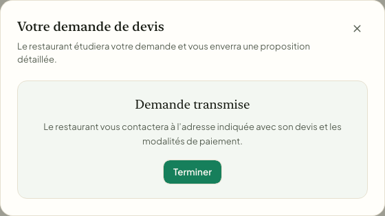

# Release candidate — Minerva Flow 2.48.0

**État : candidat web `2.48.0` — Preview courant `dpl_BZLJBoAYbFbcEmv4pSx3qfdXsSJG` (`d5f9b76`) READY; code applicatif `20197a4`. Smoke HTTP public/Auth réussi; login capturé en desktop et mobile avec Chromium headless Playwright 1.63 du cache. Les E2E authentifiés staging retentés (3 tests) ont échoué avant les assertions, avec timeouts de navigation et démarrage Chromium. Production non promue : quatre colonnes de migration 0150 sont absentes du schéma production; paiements Stripe Connect et POS E2E non validés. Le changelog in-app candidate inclut maintenant les captures traiteur desktop/mobile. L’application iOS suit une release séparée.**
Date de préparation : 2026-09-24.
Dernière vérification : 2026-09-25.
Branche `release/2.48.0`, commit applicatif vérifié `20197a4` (commit docs ensuite `d5f9b76`); paquet web `2.48.0`.

### Actions de livraison encore ouvertes — 2026-09-25

- [ ] Web production : ne pas promouvoir avant application/validation contrôlée de 0150 et paiement Connect test réussi avec capacités actives; achever POS et E2E authentifiés en staging; refaire revue complète. Production actuelle confirmée `dpl_A35dLpmKawVPfxhp9rWEWSiVcRLc` / commit `f969e15`.
- [ ] iOS/TestFlight : actualiser l’app native et préparer le build suivant (`1.0.0`, build `12` proposé après confirmation/incrément), retenter XCTest sur un runner stable, exécuter `bash ~/.Codex/hooks/app-store-compliance-guard.sh native/ios`, valider archive et dSYM, téléverser puis confirmer l’accès testeur externe. Le build courant reste `1.0 (11)`.
- [ ] Après ces validations, finaliser le changelog/release et l’envoi de courriel aux utilisateurs consentants; aucune notification n’a été envoyée.
- [x] Build Vercel du Preview courant compilé et READY; Sentry a téléversé les source maps et créé la release associée au SHA candidat. Le build local précédent (Webpack, 328 routes) a terminé avec le code 0.

## Sorties envisagées

| Cible | Sortie proposée | État |
| --- | --- | --- |
| Web | `2.48.0` | Preview `dpl_BZLJBoAYbFbcEmv4pSx3qfdXsSJG` READY; visuel login desktop/mobile capturé; promotion bloquée par le schéma prod et les tests fonctionnels ci-dessous |
| iOS / TestFlight | `1.0 (11)` | Build actuel en test interne/externe (8 testeurs); il ne contient pas les changements source de cette candidate; prochain build requis |
| GitHub Release + changelog | `v2.48.0` | Notes FR/EN préparées; publication bloquée jusqu’à la capture réelle jointe comme asset |
| Android / Google Play | Aucune | Aucun projet Android ni pipeline Android trouvé dans le dépôt |

## Notes de version — français

### Précommandes, commandes et service traiteur

- Planifiez une commande à l’avance avec un créneau de préparation, cueillette ou livraison.
- Demandez un repas personnalisé ou un service traiteur, puis recevez un devis détaillé à confirmer par le restaurant.
- Réglez le devis en ligne; une commande de production est créée après confirmation du paiement.
- Les suggestions de repas des clients sont regroupées pour aider l’équipe à décider quoi ajouter au menu.

### Fidélisation et expérience mobile

- Les clients peuvent consulter leur fidélité et retrouver leurs offres d’anniversaire dans l’application.
- L’équipe peut rechercher un client au comptoir par téléphone et confirmer son identité avant d’associer les points.
- Le rapprochement des achats POS et des points reste dépendant de la connexion POS active de chaque restaurant.

### Fiabilité

- Les tentatives de commande web et mobile gardent la même commande et la même clé durable; une session Stripe encore ouverte est réutilisée, tandis qu’une session expirée reçoit une nouvelle session avec une clé de reprise déterministe.
- Stripe peut créer un nouveau PaymentIntent pour cette nouvelle session expirée; l’identité de la commande Minerva Flow reste la même et l’ancienne session expirée ne peut plus être payée.
- Les notifications de conversion d’un devis payé sont protégées contre les webhooks Stripe répétés.
- Une fermeture de flux de rendu Next.js due au client (`The destination stream closed early.`) reste visible dans Sentry sans être présentée comme une panne critique dans l’email d’alerte.

## Release notes — English

### Preorders, ordering, and catering

- Schedule an order ahead for preparation, pickup, or delivery.
- Request a custom meal or catering service and receive an itemized quote to approve with the restaurant.
- Pay an approved quote online; a production order is created after payment confirmation.
- Customer meal suggestions are grouped to help restaurant teams decide what to add to the menu.

### Loyalty and mobile experience

- Customers can review their loyalty progress and birthday offers in the app.
- Staff can find a customer by phone and confirm their identity before associating loyalty points.
- POS purchase-to-points matching still depends on each restaurant's active POS connection.

### Reliability

- Web and mobile retries keep the same durable app order; an active Stripe session is reused, while an expired one receives a replacement session with a deterministic retry key.
- Stripe may create a new PaymentIntent for the replacement session; the Minerva Flow order identity remains unchanged, and the expired Checkout session can no longer be paid.
- Paid-quote conversion notifications are protected against repeated Stripe webhook delivery.
- A client-closed Next.js render stream (`The destination stream closed early.`) remains visible in Sentry without being mislabeled as a critical email alert.

## Changelog screenshot

Capture issue du vrai parcours public de demande traiteur, vérifié sur staging avec données synthétiques nettoyées. Les vues mobiles sont aussi conservées dans `docs/screenshots/changelog-2.48.0-catering-success-mobile.png` et [confirmation de précommande](../screenshots/changelog-2.48.0-preorder-success-mobile.png). Avant la GitHub Release, joindre une capture desktop en asset image à la release publiée afin que le workflow alimente le changelog applicatif.

## Gates avant publication

- [x] Vérifier le staging en lecture seule : tables/colonnes utilisées par la candidate et `profiles.product_updates_opt_in DEFAULT false` sont présentes. L’historique distant est horodaté et divergent des noms numérotés locaux; aucune migration en double ni entrée d’historique n’a été ajoutée.
- [x] E2E staging : 6/6 réussis — précommande planifiée payée à la cueillette, suggestion/vote et brouillon owner, devis traiteur sur place/livraison, demande owner et conversion idempotente d’un devis payé; fixtures synthétiques nettoyées.
- [x] Accounts v2 Recipient ajouté pour les nouvelles connexions restaurant, avec conservation des comptes Express v1; migration additive 0150 appliquée et colonnes vérifiées sur le staging autorisé. Historique Supabase distant horodaté divergent : SQL ciblé utilisé à la place de `db push`.
- [x] Smoke Stripe test-mode : création du destinataire synthétique, création du lien d’onboarding hébergé et lecture d’état; URL gardée secrète et compte fermé après le test.
- [ ] Valider Checkout/PaymentIntent et les reprises avec un compte Connect test dont les capacités transfert/payout sont actives. Aucun paiement en ligne complet n’est confirmé; le test précédent a été refusé (`insufficient_capabilities_for_transfer`). Le Preview utilise les ressources Supabase de production, donc aucun paiement n’y est lancé.
- [ ] Vérifier les flux POS réels et compléter les tests UI natifs.
- [x] Captures réelles E2E ajoutées : confirmation de devis traiteur desktop/mobile et confirmation de précommande mobile à 390 px.
- [x] Corriger le défaut Auth causé par `profiles.product_updates_opt_in` NOT NULL sans défaut dans le trigger d’inscription; migration `0149_signup_product_updates_default_false.sql` appliquée au staging autorisé, inscription owner et test devis staging réussis.
- [x] Captures précommande/devis traiteur ajoutées au changelog in-app candidate dans `public/assets/changelog/` et reliées à l’entrée fallback; les captures brutes sont dans `docs/screenshots/`.
- [ ] Publier l’entrée DB/GitHub Release seulement après validation du déploiement production; la publication GitHub déclenche des notifications email/push et doit inclure une image asset.
- [x] Build Vercel du Preview exact vérifié; téléversement réel des source maps Sentry confirmé dans les logs du build.
- [x] Parcours Auth et onboarding ciblés sur staging : inscription immédiate, rejet du doublon, connexion confirmée, préférence produit décochée par défaut, déclencheur Auth sans métadonnée de consentement et onboarding complet réussis.
- [x] Navigation essentielle mise à jour et testée sur staging : Workspace, Fournisseurs, Inventaire et Commandes, plus Paramètres owner/manager requis par les intégrations; Menu, Fidélisation et les autres routes produit restent redirigées vers Workspace.
- [x] Preview inspecté : `dpl_BZLJBoAYbFbcEmv4pSx3qfdXsSJG` READY pour le commit docs `d5f9b76` (code applicatif `20197a4`); smoke routes publiques et redirect owner sans session réussis.
- [ ] Vérifier les parcours E2E authentifiés sur le Preview après configuration d’une base Supabase de staging isolée; `e2e/test-env.ts` refuse explicitement les tests navigateur distants tant qu’un environnement isolé et vérifié n’est pas configuré. Ne pas contourner cette protection.
- [ ] Appliquer/valider la migration additive 0150 en production de manière contrôlée : lecture seule a confirmé que les quatre colonnes Stripe 0150 sont absentes. Ne pas exécuter `supabase db push` avant réconciliation de l’historique divergent.
- [x] Playwright visuel login Preview desktop 1440×900 et mobile 390×844 : pas d’overflow horizontal ni d’erreurs JavaScript; captures dans `docs/screenshots/preview-login-2026-09-25-*`. `/en/login` affiche du texte français, à examiner séparément.
- [ ] Refaire l’E2E authentifié/POS sur staging : la reprise actuelle échoue avant assertions métier par timeouts `/login`/`/workspace` et démarrage du navigateur; les traces sont dans `test-results/` local, non commitées.
- [ ] Revue complète des écrans Preview, clavier et zoom, avant toute promotion.
- [x] Compiler l’application, vérifier l’UUID du dSYM Sentry, téléverser l’archive `1.0 (11)` et confirmer son traitement par Apple.
- [ ] Relancer XCTest sur un runner stable : la compilation Simulator est réussie, mais les dernières tentatives XCTest n’ont produit aucun résultat confirmé.
- [x] Enregistrer les notes de test et de review, la politique de confidentialité, et les identifiants vérifiés du compte démo dans App Store Connect.
- [x] Assigner le build 11 au groupe externe et soumettre à l’examen bêta avec notification automatique; Apple affiche le build « En cours de test » dans le groupe externe (8 testeurs). Lien public vérifié HTTP 200 : https://testflight.apple.com/join/xGr45uuF.
- [x] Audit App Store statique du 2026-09-24 : 0 risque critique, 0 élevé et 2 avertissements; les contrôles manuels de publication publique (captures, déclarations de confidentialité, accords et métadonnées) restent ouverts.
- [ ] Vérifier la parité des descriptions publiées avec les capacités réellement activées chez chaque restaurant.
- [ ] Ne créer une release GitHub publiée qu’après validation des parcours restants et d’un build aligné sur le commit; `.github/workflows/publish-release.yml` publie l’entrée de changelog et déclenche les notifications associées.

## État des vérifications au 2026-09-25

- Vérification locale de la candidate : 335 tests unitaires (58 fichiers), TypeScript `--noEmit`, lint ciblé et build Next passent; la compilation iOS Simulator passe également. Les XCTest précédents restent sans résultat confirmé, le runner Xcode s’étant bloqué.
- Preview courant `dpl_BZLJBoAYbFbcEmv4pSx3qfdXsSJG` READY; source code `20197a4`, suivi d’un commit documentaire `d5f9b76`. Smoke HTTP : login, inscription, pages légales 200; routes owner redirigées au login. Playwright visuel login desktop/mobile réussi avec Chromium headless 1.63 récupéré dans le cache existant; le test E2E authentifié staging a échoué avant assertions.
- Aucun E2E authentifié ou avec écritures n’a été lancé contre le Preview : il utilise Supabase production, et le garde `e2e/test-env.ts` exige une base isolée explicitement autorisée. Le staging reste l’environnement utilisé pour les E2E synthétiques.
- 335 tests unitaires et E2E staging (6/6), reprise précommande/traiteur (2/2) et E2E owner Paramètres/Intégrations (1/1) passent. Aucun paiement Stripe Connect complet n’est confirmé : le destinataire de test ne possède pas de capacité de transfert (`insufficient_capabilities_for_transfer`). Les E2E POS ne sont pas terminés.
- La migration 0150 a été appliquée et vérifiée au staging seulement. Lecture seule sur production confirme l’absence des quatre colonnes Stripe 0150; ne pas promouvoir avant résolution et vérification du schéma, en tenant compte du journal Supabase distant divergent.
- Le build TestFlight actif `1.0 (11)` n’inclut pas cette candidate; aucun nouveau binaire iOS n’a été téléversé. Aucun tag, release GitHub ni courriel utilisateur n’a été émis.
- **Décision : NOT READY pour la production et TestFlight.** Restent l’application/validation 0150 en production, un paiement/réessai Stripe avec destinataire actif, POS E2E, reprise E2E authentifiée staging, revue visuelle complète, XCTest stable, contrôles App Store et nouveau binaire iOS.
